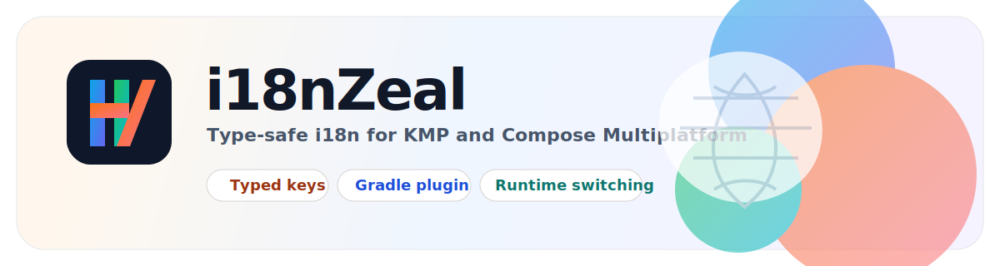

# i18nZeal 中文文档

<p align="center">
  
</p>

<p align="center">
  <a href="https://search.maven.org/artifact/io.github.xczcdjx/i18n-runtime">
    
  </a>
  <a href="https://kotlinlang.org/">
    
  </a>
  <a href="https://www.jetbrains.com/lp/compose-multiplatform/">
    
  </a>
  <a href="../LICENSE">
    
  </a>
</p>

<p align="center">
  <a href="https://kotlinlang.org/docs/multiplatform.html">
    
  </a>
</p>

English README 请见 [README.md](../README.md)。

`i18nZeal` 为 Kotlin Multiplatform 应用提供类型安全的国际化能力，并对 Compose Multiplatform 提供一等支持。

从 JSON、YAML、Properties 或 Kotlin 多语言文件生成类型化翻译 key 和具备 locale 感知能力的翻译引擎，再通过轻量 runtime 在 Android、iOS、JVM、JS 和 Wasm 上统一完成文本解析与语言切换。

## 亮点

- 在构建期生成类型安全的翻译 key 和 `I18nEngine` 实现
- 提供适配 Compose 的翻译 API，支持 `CompositionLocal` 和运行时语言状态
- 支持 `json`、`yaml`、`properties`、`kt` 等多语言文件格式
- 一套 i18n 工作流覆盖 Android、iOS、桌面、Web 和 Wasm 目标

它主要由两部分组成：

- `i18n-runtime`：提供 `Locale`、当前语言状态、`CompositionLocal` 和翻译查询能力。
- `i18n-gradle-plugin`：根据多语言文件生成 Kotlin 常量和 `I18nEngine` 实现。

## 模块说明

- `i18n-runtime`：可发布的 KMP runtime 库。
- `i18n-gradle-plugin`：可发布的 Gradle 插件。
- `shared`：示例共享模块，演示插件和 runtime 的使用方式。
- `androidApp`、`desktopApp`、`webApp`、`iosApp`：示例应用目标，包含 Web 支持。

## Gradle 配置使用

### 1.在共享模块中应用插件：

```kotlin

plugins {
    // ...
    id("io.github.xczcdjx.i18nzeal")
}

i18nZeal {
    sourceLocales = listOf("en", "zh")
    packageName = "com.example.app.i18n" // generated 包名,请与你的项目一致
    // inputDir = "src/commonMain/i18n" // 默认来源目录
    // fileType = I18nFileType.JSON 默认json
}
```

扩展配置默认值：

- `fileType = I18nFileType.JSON`
- `sourceLocales = emptyList()`（需要显式配置）
- `inputDir = "src/commonMain/i18n"`
- `outputDir = "generated/i18nzeal/commonMain/kotlin"`
- `packageName = null`（需要显式配置）
- `objectName = "I18nZeal"`

### 2.把生成目录加入 `commonMain`：

```kotlin
kotlin {
    sourceSets {
        commonMain {
            kotlin.srcDir(layout.buildDirectory.dir("generated/i18nzeal/commonMain/kotlin"))
        }
    }
}
```

### 3.让编译依赖生成任务：

```kotlin
tasks.withType<KotlinCompilationTask<*>>().configureEach {
    dependsOn(tasks.named("generateI18nKt"))
}
```

如果你想切换到 `.properties`：

```kotlin
i18nZeal {
    sourceLocales = listOf("en", "zh")
    inputDir = "src/commonMain/i18n-properties"
    fileType = I18nFileType.PROPERTIES
    packageName = "com.example.app.i18n"
}
```

支持的 `fileType`：

- `I18nFileType.JSON`
- `I18nFileType.YAML`
- `I18nFileType.PROPERTIES`
- `I18nFileType.KT`

如果使用已发布插件：

```kotlin
plugins {
    id("io.github.xczcdjx.i18nzeal") version "$i18nZealVersion"
}
```

添加 runtime 依赖：

```kotlin
commonMain.dependencies {
    implementation("io.github.xczcdjx:i18n-runtime:$i18nZealVersion")
}
```

如果项目里还使用 Compose 资源字体或其他共享资源，建议同时保留：

```kotlin
commonMain.dependencies {
    implementation(compose.components.resources)
}
```

## 生成代码

插件会生成类似下面的 Kotlin 文件：

```kotlin
package com.example.app.i18n

import com.djx.i18n.runtime.export.Locale
import com.djx.i18n.runtime.interfaces.I18nEngine

val Lang_En = Locale("en")
val Lang_Zh = Locale("zh")

object I18nKeys {
    const val app_name = "app.name"
    const val count = "count"
}

object I18nZeal : I18nEngine {
    override fun get(
        key: String?,
        locale: Locale,
        fallback: String,
        vararg args: Any?,
    ): String {
        TODO()
    }
}
```

占位符使用从 `0` 开始的索引：

```json
{
  "count": "Count,{0}"
}
```

调用方式：

```kotlin
tr(I18nKeys.count, count)
```

## Runtime 用法

初始化 runtime：

```kotlin
I18nRuntime.init(I18nZeal)
```

在 Compose 中提供当前语言：

```kotlin
CompositionLocalProvider(
    AppLocalLangProvider provides AppLangState.current.value
) {
    MainContent()
}
```

### Composable 内翻译

```kotlin
Text(tr(I18nKeys.app_name))
Text(tr(I18nKeys.count, count))
Text(I18nKeys.app_name.tri18n())
Text(I18nKeys.count.tri18n(count))
```

### Composable 外翻译

```kotlin
val title = trn(I18nKeys.app_name)
val countText = I18nKeys.count.trnI18n(count)
```

说明：

- `tr(...)`、`tri18n(...)` 是 `@Composable` 方法，会读取 `AppLocalLangProvider.current`
- `trn(...)`、`trnI18n(...)` 是非 Compose 方法，会读取 `AppLangState.current.value`

### 切换语言

```kotlin
AppLangState.change(Lang_En)
AppLangState.change(Lang_Zh)
```

### Android Debug 运行时加载

默认模式下，i18nZeal 会把多语言文件生成 Kotlin 代码并编译进 App。这个模式类型安全、性能稳定，但修改语言文件后通常需要重新编译。

Android 调试阶段可以使用 `AndroidDebugI18nLoader` 从运行时文件读取翻译，并 fallback 到生成的 `I18nZeal`：

```kotlin
import com.djx.i18n.runtime.I18nRuntime
import com.djx.i18n.runtime.android.AndroidDebugI18nLoader
import com.example.app.i18n.I18nZeal

val engine = if (BuildConfig.DEBUG) {
    AndroidDebugI18nLoader.fromFiles(
        directory = File(filesDir, "i18n"),
        locales = listOf("en", "zh"),
        fallbackEngine = I18nZeal,
    )
} else {
    I18nZeal
}

I18nRuntime.init(engine)
```

调试文件目录示例：

```text
/data/data/你的包名/files/i18n/en.json
/data/data/你的包名/files/i18n/zh.json
```

也可以从 `assets` 读取：

```kotlin
AndroidDebugI18nLoader.fromAssets(
    context = this,
    locales = listOf("en", "zh"),
    assetDir = "i18n",
    fallbackEngine = I18nZeal,
)
```

注意：`assets` 本身仍然打包在 APK 中，修改后通常还是需要重新安装或应用变更；真正适合开发期热更新的是 `fromFiles(...)`。


## 支持的输入文件格式

插件支持以下多语言文件格式：

- `json`
- `yaml` / `yml`
- `properties`
- `kt`

同一个输入目录内建议只放同一种文件类型，并通过 `fileType` 明确指定。

### JSON 示例

目录：

```text
shared/src/commonMain/i18n/en.json
shared/src/commonMain/i18n/zh.json
```

内容：

```json
{
  "app": {
    "name": "i18nZeal"
  },
  "lang": {
    "current": "Current Language",
    "system": "System",
    "en": "English",
    "zh": "Chinese"
  },
  "count": "Count,{0}"
}
```

### YAML 示例

目录：

```text
shared/src/commonMain/i18n-yaml/en.yaml
shared/src/commonMain/i18n-yaml/zh.yaml
```

内容：

```yaml
app:
  name: i18nZeal
lang:
  current: Current Language
  system: System
  en: English
  zh: Chinese
count: "Count,{0}"
```

### Properties 示例

目录：

```text
shared/src/commonMain/i18n-properties/en.properties
shared/src/commonMain/i18n-properties/zh.properties
```

内容：

```properties
app.name=i18nZeal
lang.current=Current Language
lang.system=System
lang.en=English
lang.zh=Chinese
count=Count,{0}
```

说明：

- `.properties` 文件现在按 UTF-8 读取，可以直接写中文，不需要转成 `\uXXXX`。

### Kotlin Map 示例

目录：

```text
shared/src/commonMain/i18n-kt/en.kt
shared/src/commonMain/i18n-kt/zh.kt
```

内容：

```kotlin
object I18nZeal_en {
    val map = mapOf(
        "app.name" to "i18nZeal",
        "lang.current" to "Current Language",
        "lang.system" to "System",
        "lang.en" to "English",
        "lang.zh" to "Chinese",
        "count" to "Count,{0}",
    )
}
```

## 键名规则

嵌套 JSON/YAML 会被拍平成点分格式：

- `app.name` 会生成 `I18nKeys.app_name`
